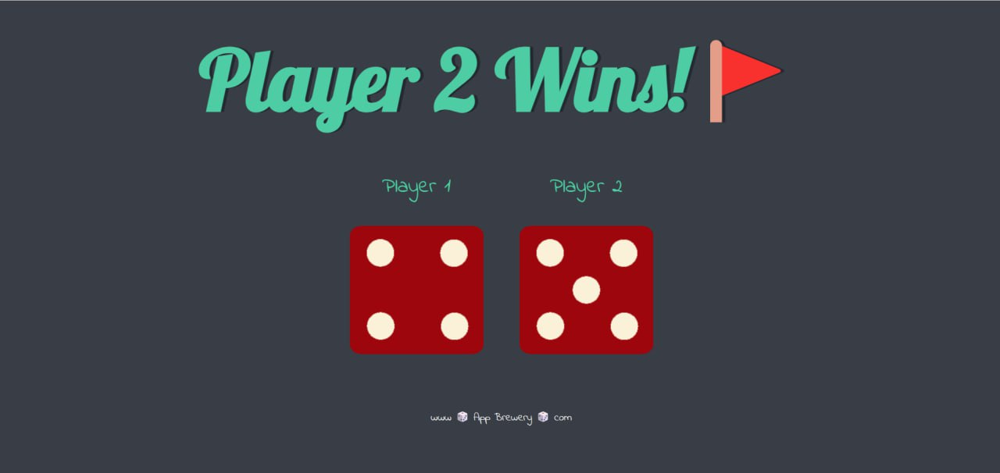

# TheDice-challenge
<i>Simple game of Dice using the Javascript concept of Random Number Generation along with HTML and CSS.</i>

# Feature
The website simulates a dice game challenge where on every refresh both dice are thrown and a random dice face is generated for both players.
 
<ul><li>Developed a interactive dice game using HTML, CSS, and JavaScript.</li>
<li>Implemented game logic to simulate rolling dice and determining winners based on dice values.</li>
<li>Designed responsive user interface with CSS for a visually appealing experience.</li>
<li>Utilized JavaScript event handling for user interactions and game outcomes.</li></ul>

<b>The player with larger Dice wins!</b>

